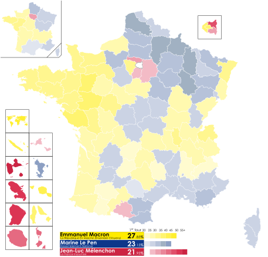
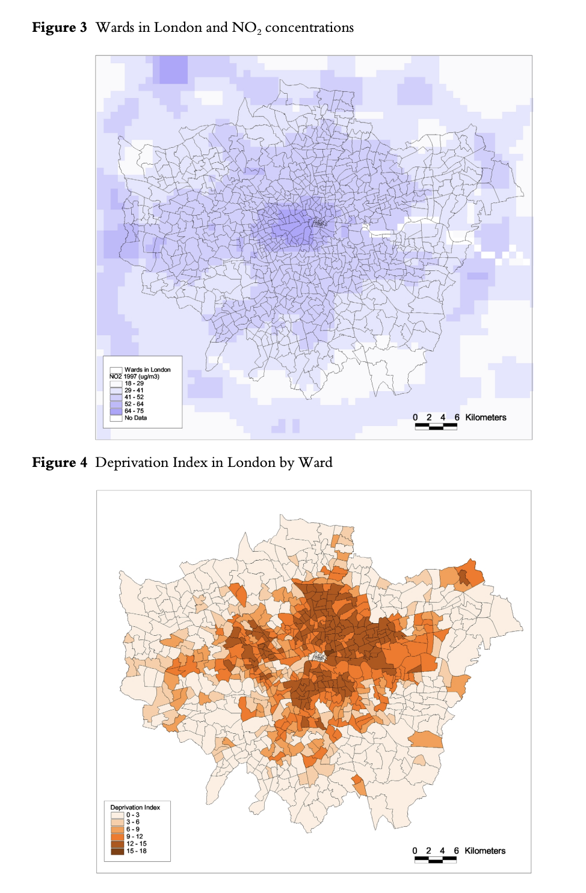
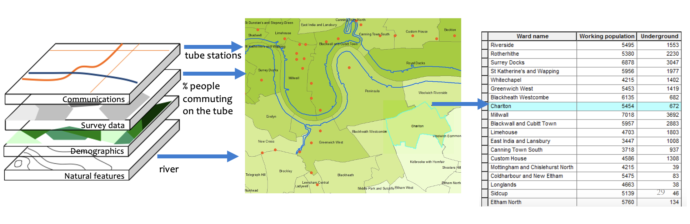
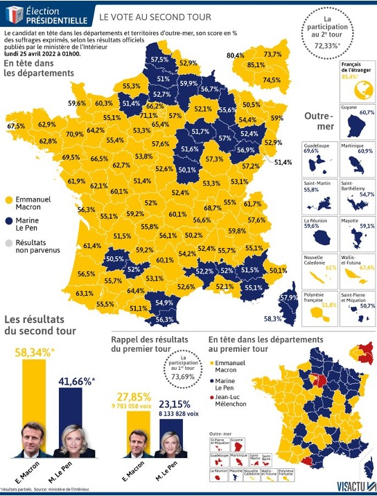

## Vue d'ensemble de la formation {#sec-overview}

Ce cours est structuré en deux jours et trois modalités complémentaires :

-   **Présentations** — notions de cartographie et de SIG, contexte théorique
-   **Hands-on** — démonstrations guidées en R/Quarto sur des données réelles
-   **Do it yourself** — exercices à reproduire de façon autonome (avec corrigés)

Le fil conducteur est géographique : Londres pour les démonstrations, Paris et la Corse pour les exercices. Les données utilisées tout au long du cours sont des données ouvertes réelles — transactions immobilières, annonces Airbnb, MNT SRTM, données GPW de population.

## Philosophie du cours {#sec-philosophy}

Ce cours propose **un aperçu général** des nombreuses méthodes et techniques disponibles pour exploiter les données spatiales. L'accent est mis sur :

-   L'**intuition** plutôt que l'exhaustivité technique
-   L'**application** et l'utilisation concrète
-   Les **connexions avec le monde réel**
-   L'autonomisation pour **continuer par vous-mêmes**

::: callout-tip
## Une citation à garder en tête

Le statisticien George Box disait : *"Tous les modèles sont faux, mais certains sont utiles."*

De la même façon, le géographe Keith Ord suggère : *"Toutes les cartes sont fausses, mais certaines sont utiles."*
:::

------------------------------------------------------------------------

## Pourquoi les Systèmes d'Information Géographique ? {#sec-why-gis}

L'information géographique joue un rôle crucial dans nos sociétés modernes. Elle intervient dans des domaines aussi variés que le logement, le transport, l'assurance, la banque, les télécommunications, la logistique, l'énergie, le commerce de détail, l'agriculture, la santé et l'urbanisme.

Travailler avec des SIG permet de :

-   **Analyser et extraire** des informations à partir de données géospatiales
-   **Travailler sur des données du monde réel** dans de nombreux domaines
-   **Acquérir des compétences clés** en science des données spatiales — très demandées dans l'industrie

### Un premier exemple : visualiser les élections françaises

La cartographie est un outil puissant pour comprendre les phénomènes sociaux et politiques. La carte ci-dessous illustre les résultats du second tour de l'élection présidentielle française de 2022, département par département.

{fig-alt="Carte choroplèthe des résultats électoraux en France" width="80%"}

Ce type de carte — une **choroplèthe** — colorie chaque unité géographique selon la valeur d'une variable. Elle rend immédiatement lisible une distribution spatiale qui serait opaque sous forme de tableau.

### Applications SIG typiques

**Faire des cartes pour comprendre des tendances sociales** Élections, inégalités, phénomènes naturels — la carte reste l'un des outils les plus intuitifs pour communiquer et analyser des phénomènes géographiques.

**Sélectionner des données selon des critères spatiaux**

-   Quelles stations de surveillance de la pollution se trouvent à moins de 1 km de la station Holborn ?
-   Combien de logements sociaux se trouvent sur un territoire donné ?

**Transformer et réagréger des données**

-   Associer les données sur les logements et leurs prix aux données sur les écoles et leurs résultats scolaires
-   Prédiction et interpolation basées sur des modèles spatiaux

**Répondre à des questions causales**

-   Les prix des logements ont-ils augmenté suite à une politique spatiale ?

**Sélectionner un site**

-   Quel est le meilleur emplacement pour un parc éolien selon des critères spécifiques ?

::: {.callout-note collapse="true"}
## Exemple : Pollution et pauvreté à Londres

Les niveaux de polluants locaux (NO₂ + PM10) peuvent être élevés dans certaines régions, avec des effets néfastes sur la santé humaine.

**Question de recherche :** Les personnes vivant dans des zones très défavorisées sont-elles exposées de manière disproportionnée à des niveaux de pollution plus élevés ?

Le SIG permet ici de rassembler différents types de données dans un système à référence spatiale commune — données de NO₂ collectées à partir de la localisation des routes et des usines, indice de privation par quartier (LSOA, ward, code postal) — puis de les superposer pour tester l'hypothèse.

{fig-alt="Exploration de données" width="80%"}

*Référence : King and Stedman (2000), "Analysis of Air Pollution and Social Deprivation"*
:::

------------------------------------------------------------------------

## Geographic Data Science {#sec-gds}

Il existe une distinction importante entre les approches :

| Approche | Description |
|--------------------------------|----------------------------------------|
| **SIG classique** | Production de cartes et produits analytiques via un logiciel de bureau (ex. QGIS, ArcGIS) |
| **Geographic Data Science** | Écriture de code et pipelines produisant des représentations cartographiques et analytiques reproductibles |

Ce cours adopte une approche **Geographic Data Science** : vous écrirez du code, construirez des pipelines, et produirez des résultats reproductibles.

------------------------------------------------------------------------

## Les données dans les SIG {#sec-data}

### Quelles informations les SIG utilisent-ils ?

Un SIG intègre des couches d'information hétérogènes géoréférencées. Le principe fondamental est la **superposition de couches** (*layers*) : chaque couche représente un thème ou une variable, et l'analyse consiste à les combiner.

{fig-alt="Diagramme de superposition de couches SIG" width="80%"}

Les couches typiques incluent :

-   Données définissant des caractéristiques géographiques (routes, rivières)
-   Types de sol, utilisation du sol, altitude
-   Démographie, attributs socio-économiques
-   Environnement, climat, qualité de l'air

### Types de données : Vecteur

Les données vectorielles représentent les entités géographiques sous forme de **points**, **lignes** et **polygones**, chacune associée à une table attributaire.

{fig-alt="Données vectorielles SIG avec carte et table attributaire" width="70%"}

**Les trois types géométriques :**

| Géométrie | Exemples                              |
|-----------|---------------------------------------|
| Point     | Stations, adresses, relevés de mesure |
| Ligne     | Routes, rivières, réseaux             |
| Polygone  | Quartiers, communes, parcelles        |

### Types de données : Matricielles (Raster)

Les données raster représentent l'espace sous forme d'une **grille régulière de pixels**. Chaque cellule contient une valeur unique (continue ou catégorielle).

**Caractéristiques :**

-   Équivalent aux formats d'images numériques (JPEG, TIFF…)
-   Adapté aux surfaces continues : altitude, pollution, occupation du sol
-   La conversion vecteur → raster est simple ; l'inverse est complexe

::: callout-tip
## Vecteur ou Raster ?

Utilisez le **vecteur** pour des entités discrètes avec des frontières nettes (quartiers, routes, bâtiments).

Utilisez le **raster** pour des phénomènes continus dans l'espace (température, altitude, densité).
:::

### Types de fichiers

| Format | Extension | Description |
|------------------|-------------------------|-----------------------------|
| **Geopackage** | `.gpkg` | Open Source · OGC standard · Un seul fichier · Plusieurs couches · **Recommandé** |
| **Shapefile** | `.shp` | Standard ESRI · Multi-fichiers · Limité à 2 Go |
| **GeoJSON** | `.geojson` | Format texte · Basé sur JSON · Idéal pour le web et les APIs |
| **Raster** | `.tif`, `.img`… | Format grille (image) |
| **Tables** | `.csv`, `.txt`, `.xlsx` | Tableurs avec colonnes de coordonnées |

::: callout-warning
## Shapefiles : limitations à connaître

-   Format multi-fichiers (`.shp`, `.dbf`, `.shx`, `.prj`…) — ne jamais envoyer uniquement le `.shp` !
-   Noms d'attributs limités à **10 caractères**
-   Taille de fichier limitée à **2 Go**
-   Un seul type de géométrie par fichier

**Préférez le GeoPackage** (`.gpkg`) pour les nouveaux projets.
:::

------------------------------------------------------------------------

## Pourquoi R ? {#sec-why-r}

Plusieurs outils permettent de travailler avec des données spatiales. Ce cours utilise **R + RStudio** parmi d'autres options :

{fig-alt="Logos des logiciels SIG : Python, ArcMap, ArcGIS Pro, QGIS, R, RStudio" width="85%"}

R se distingue par :

-   **Communauté incroyable** (#rstats)
-   **Gestion des données** accessible et puissante (`tidyverse`)
-   **Répertoire exceptionnel** de méthodes statistiques et spatiales (`sf`, `terra`, `gstat`, `exactextractr`…)
-   **Interopérabilité** avec d'autres langages (Python intégrable via `reticulate`)
-   **Visualisation** de haute qualité avec `ggplot2` — le même outil pour les cartes et les graphiques
-   **Reproductibilité** totale via les scripts et Quarto

### L'environnement RStudio

RStudio est un IDE (*Integrated Development Environment*) qui organise le travail en quatre panneaux :

| Panneau | Rôle |
|----|----|
| **Scripts / Quarto** | Écrire et sauvegarder les commandes |
| **Console** | Exécuter du code et voir les résultats |
| **Environnement** | Variables et objets chargés en mémoire |
| **Fichiers / Plots / Packages / Aide** | Navigation et visualisation |

### Quarto

Quarto (successeur de R Markdown) permet de mélanger code, texte et graphiques pour produire :

-   Des rapports automatisés et reproductibles
-   Des présentations
-   Des **sites web** (comme ce cours !)
-   Des tableaux de bord interactifs

------------------------------------------------------------------------

## Les bases de R {#sec-r-basics}

### Objets et types de données

En R, tout est un **objet**. Les principaux types sont :

```{r}
#| label: r-types
#| eval: false

# Logique (booléen)
class(TRUE)

# Caractère (chaîne de texte)
class("Je suis une ville")

# Numérique
class(2021)

# Facteur (catégories ordonnées)
class(as.factor(c("rural", "urbain", "périurbain")))

# Valeur manquante
c(NA, 1, 2, NA)
```

### Data frames

Un *data frame* est une structure tabulaire à deux dimensions :

```{r}
#| label: dataframe-demo
#| eval: false

# Accès par position [ligne, colonne]
dat[1, ]       # première ligne
dat[, 1]       # première colonne
dat[6, 3]      # 6e ligne, 3e colonne

# Accès par nom de colonne
dat$population

# Filtrage conditionnel
dat[dat$population > 10000, ]

# Explorer la structure
str(mon_dataframe)
summary(mon_dataframe)
```

### Packages R

Les packages sont au cœur de R. Les principaux packages spatiaux que nous utiliserons :

```{r}
#| label: packages
#| eval: false

# Installer (une seule fois)
install.packages(c(
  "sf",                  # données vectorielles
  "spData",              # jeux de données géographiques d'exemple
  "terra",               # données raster
  "stars",               # données raster multi-dimensionnelles
  "tidyterra",           # terra + ggplot2
  "ggplot2",             # visualisation — outil principal du cours
  "patchwork",           # assembler plusieurs graphiques
  "dplyr",               # manipulation de données
  "classInt",            # classification choroplèthe
  "viridis",             # palettes perceptuellement uniformes
  "RColorBrewer",        # palettes ColorBrewer
  "scales",              # formatage axes et légendes
  "ggspatial",           # flèche nord et barre d'échelle
  "rnaturalearth",       # données géographiques mondiales
  "rnaturalearthdata",   # données Natural Earth
  "maps",                # données cartographiques de base
  "spdep",               # poids spatiaux et voisinage
  "gstat",               # interpolation IDW
  "exactextractr",       # statistiques zonales raster → polygones
  "leaflet",             # cartes interactives
  "mapsf"                # cartographie thématique (illustré brièvement)
))

# Charger (à chaque session)
library(sf)
library(ggplot2)
library(dplyr)
```

::: callout-tip
## Rester à jour

Suivez **#rstats** sur les réseaux sociaux ou consultez [r-spatial.org](https://r-spatial.org) pour les actualités des packages spatiaux.
:::

------------------------------------------------------------------------

### Le pipe `|>` {#sec-pipe}

Le **pipe** est un opérateur qui passe le résultat d'une expression à la suivante. Il permet d'enchaîner des opérations sans créer d'objets intermédiaires, ce qui rend le code beaucoup plus lisible.

```{r}
#| label: pipe-demo
#| eval: false

# Sans pipe — difficile à lire, on lit de l'intérieur vers l'extérieur
head(filter(select(mon_df, nom, prix), prix > 100), 5)

# Avec pipe |> — on lit de gauche à droite, étape par étape
mon_df |>
  select(nom, prix) |>
  filter(prix > 100) |>
  head(5)
```

::: callout-note
## `|>` vs `%>%`

Vous verrez les deux dans des codes R existants. Ils font essentiellement la même chose :

| Opérateur | Origine | Usage |
|-----------------------------|------------------------|-------------------|
| `|>` | R natif (depuis R 4.1) | **Recommandé** — aucun package requis |
| `%>%` | Package `magrittr` / `dplyr` | Très répandu dans les anciens scripts |

Dans ce cours nous utilisons `|>` partout.
:::

------------------------------------------------------------------------

### La grammaire de `ggplot2` {#sec-ggplot}

`ggplot2` repose sur une **grammaire des graphiques** (*grammar of graphics*) : chaque carte ou graphique est construit couche par couche avec `+`.

```{r}
#| label: ggplot-structure
#| eval: false

ggplot(data = mon_sf) +                    # 1. données de base
  geom_sf(aes(fill = ma_variable)) +       # 2. géométrie + mapping esthétique
  scale_fill_viridis_c(name = "Légende") + # 3. échelle de couleur
  labs(title = "Titre", caption = "...") + # 4. étiquettes
  theme_void()                             # 5. thème (fond, axes…)
```

**Les éléments clés :**

| Élément | Rôle | Exemple |
|---------------------------|------------------|---------------------------|
| `ggplot()` | Initialiser le graphique | `ggplot(data = france)` |
| `geom_*()` | Choisir la forme visuelle | `geom_sf()`, `geom_histogram()`, `geom_point()` |
| `aes()` | Lier une variable à une esthétique | `aes(fill = chomage)` |
| `scale_*()` | Contrôler couleurs, axes, légende | `scale_fill_viridis_c()` |
| `labs()` | Ajouter titres et sources | `labs(title = "...", caption = "...")` |
| `theme_*()` | Contrôler l'apparence générale | `theme_void()`, `theme_minimal()` |
| `+` | Ajouter une couche | Toujours `+`, jamais `|>` |

::: callout-tip
## `ggplot2` pour les cartes ET les graphiques

C'est le choix central de ce cours : la **même syntaxe** sert à produire des histogrammes, des nuages de points, et des cartes choroplèthes. Apprendre une grammaire suffit pour tout visualiser.

```{r}
#| eval: false

# Histogramme
ggplot(mon_df, aes(x = prix)) + geom_histogram()

# Nuage de points
ggplot(mon_df, aes(x = superficie, y = prix)) + geom_point()

# Carte choroplèthe
ggplot(mon_sf) + geom_sf(aes(fill = prix))
```
:::

------------------------------------------------------------------------

### Lire les labels de `cut()` : `(`, `[`, `]`, `)` {#sec-brackets}

Lorsque vous classifiez une variable continue avec `cut()` — pour créer des classes sur une carte choroplèthe — R affiche les bornes avec des crochets qui viennent des **notations mathématiques des intervalles** :

| Symbole | Signification              | Exemple                                 |
|---------------------|-------------------------------|---------------------|
| `(`     | borne **exclue** (ouverte) | `(10, 20]` : strictement supérieur à 10 |
| `[`     | borne **incluse** (fermée) | `[10, 20)` : supérieur ou égal à 10     |
| `]`     | borne **incluse**          | `(10, 20]` : inférieur ou égal à 20     |
| `)`     | borne **exclue**           | `[10, 20)` : strictement inférieur à 20 |

Donc `(4.5, 7.1]` signifie : *"valeurs strictement supérieures à 4,5 et inférieures ou égales à 7,1"*.

Ce cours utilise une fonction utilitaire pour remplacer automatiquement ces notations par des labels lisibles du type `4.5 – 7.1` :

```{r}
#| label: clean-labels
#| eval: false

# Fonction à copier dans vos scripts
clean_cut_labels <- function(x) {
  levels(x) <- gsub("\\(|\\[|\\]|\\)", "", levels(x)) |>
    gsub(",", " – ", x = _)
  x
}

# Utilisation
ma_variable_classee <- cut(mon_vecteur,
                            breaks = mes_bornes,
                            include.lowest = TRUE,
                            dig.lab = 4,
                            ordered_result = TRUE) |>
  clean_cut_labels()
```

------------------------------------------------------------------------

## Structure du cours {#sec-structure}

Ce cours est organisé en deux grandes sections, chacune accompagnée de ses corrigés.

**Section 1 — Les fondamentaux**

| Chapitre | Contenu |
|--------------------------------------|----------------------------------|
| [Objets spatiaux](simplefeatures.qmd) | Types géométriques, objets `sf`, premières cartes |
| [Choroplèthes](choropleths.qmd) | Classification, palettes, méthodes de discrétisation |
| [Systèmes de coordonnées](crs.qmd) | SCR, projections, reprojection |
| [Données raster](raster.qmd) | Introduction aux MNT, packages `terra` et `stars` |

**Section 2 — Géotraitement et analyse spatiale**

| Chapitre | Contenu | Corrigé |
|--------------------------|-----------------------|-----------------------|
| [Géotraitement — Londres](geoprocessing_Londres.qmd) | Jointures spatiales, zones tampons, distance | [Paris](geoprocessing_Paris.qmd) |
| [Indices topographiques](indices_topo.qmd) | Pente, reclassification, extraction — Liban | [Corse](indices_topo_Corse.qmd) |
| [Interpolation spatiale](interpolation.qmd) | IDW, heatmaps — Londres | [Paris Airbnb](interpolation_Paris.qmd) |

------------------------------------------------------------------------

## Prochaine étape {#sec-next}

Commençons par les fondamentaux : importer des données spatiales, les manipuler, et produire nos premières cartes avec R.

> **→ [Objets Spatiaux et Premières Cartes](simplefeatures.qmd)**

------------------------------------------------------------------------

*Dr. Elisabetta Pietrostefani — Directrice Adjointe, Geographic Data Science Lab — Université de Liverpool \| Co-Directrice, [Imago : Data Service for Imagery](https://imago.ac.uk/) \| Chercheuse Associée, London School of Economics*
